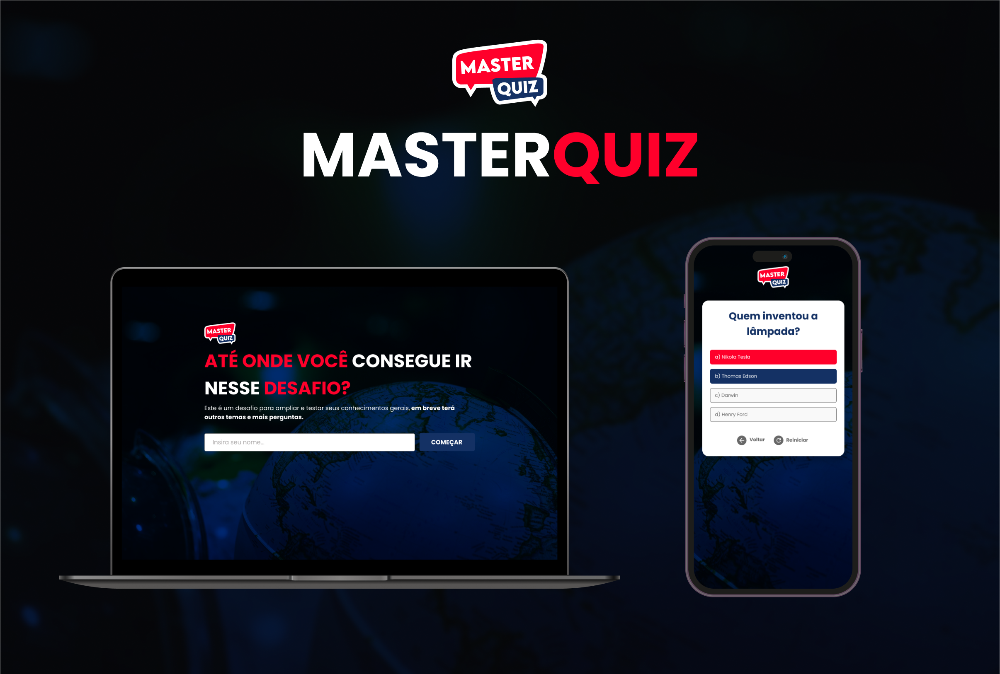

<h1 align="center"> MasterQuiz </h1>

Projeto de aplicação web de perguntas e respostas sobre conhecimento geral.  

  

## 🚀 Tecnologias

Esse projeto foi desenvolvido com as seguintes tecnologias:

- HTML e CSS
- JavaScript
- Git e Github
- Figma

---

- Link do <a href="https://ronald-santos10.github.io/MasterQuiz/">Projeto</a>

Feito por Ronald Santos!